# Two-Stream Deep Learning Architecture for Action Recognition by Using Extremely Low-Resolution Infrared Thermopile Arrays
## Igor Morawski, Wen-Nung Lie

### _**Video (YouTube)**_

&nbsp;&nbsp;&nbsp;&nbsp;&nbsp; Examples of thermopile sensor array recordings. 

### _**Sample actions in the dataset**_
 <table>
  <tr>
    <td> 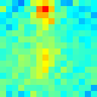</td>
    <td> 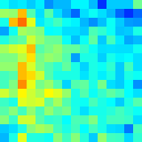</td>
    <td> 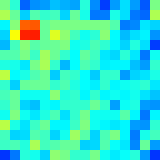</td>
  </tr>
  <tr>
    <th><i>falling0</i></th>
    <th><i>falling1</i></th>
    <th><i>falling2</i></th>
  </tr>
  <tr>
    <td> 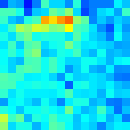</td>
    <td> 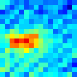</td>
    <td> 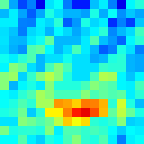</td>
  </tr>
  <tr>
    <th><i>lie0</i></th>
    <th><i>lie1</i></th>
    <th><i>lie2</i></th>
  </tr>
  <tr>
    <td> 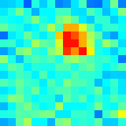</td>
    <td> 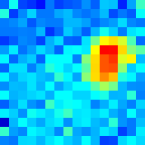</td>
    <td> 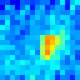</td>
  </tr>
  <tr>
    <th><i>sit0</i></th>
    <th><i>sit1</i></th>
    <th><i>sit2</i></th>
  </tr>
  <tr>
    <td> 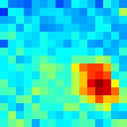</td>
    <td> 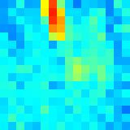</td>
    <td> 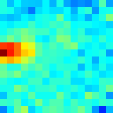</td>
  </tr>
  <tr>
    <th><i>sitdown0</i></th>
    <th><i>sitdown1</i></th>
    <th><i>sitdown2</i></th>
  </tr>
  <tr>
    <td> 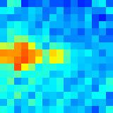</td>
    <td> 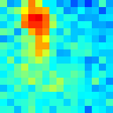</td>
    <td> 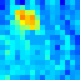</td>
  </tr>
  <tr>
    <th><i>stand0</i></th>
    <th><i>stand1</i></th>
    <th><i>stand2</i></th>
  </tr>
  <tr>
    <td> 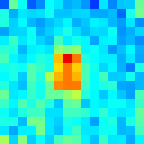</td>
    <td> 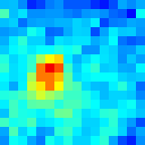</td>
    <td> 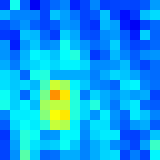</td>
  </tr>
  <tr>
    <th><i>standup0</i></th>
    <th><i>standup1</i></th>
    <th><i>standup2</i></th>
  </tr>
  <tr>
    <td> 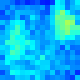</td>
    <td> 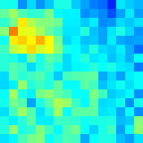</td>
    <td> 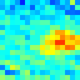</td>
  </tr>
  <tr>
    <th><i>walk0</i></th>
    <th><i>walk1</i></th>
    <th><i>walk2</i></th>
  </tr>
</table> 

###Architecture
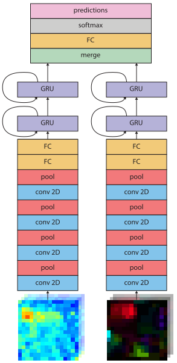
**The inputs are temperature sequence and optical flow sequence, respectively.**

### You can find out more about me on my [personal website](https://igor-morawski.github.io/).

